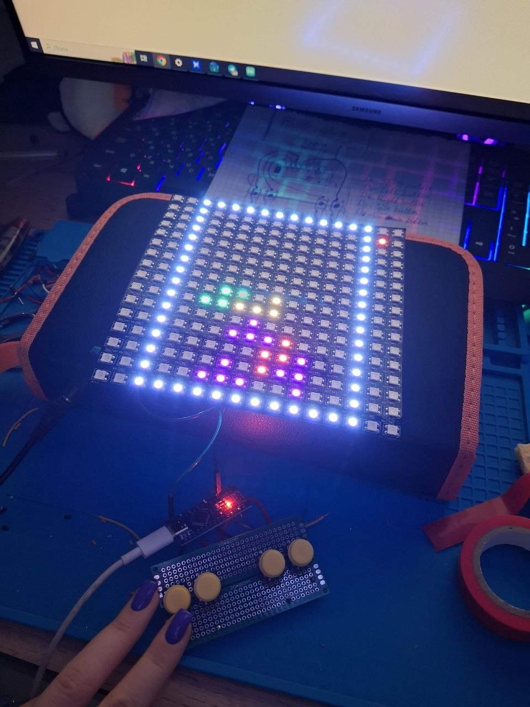
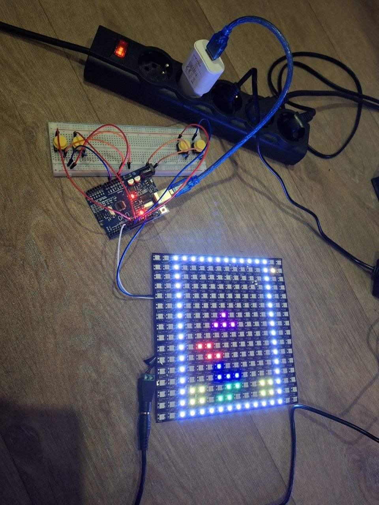
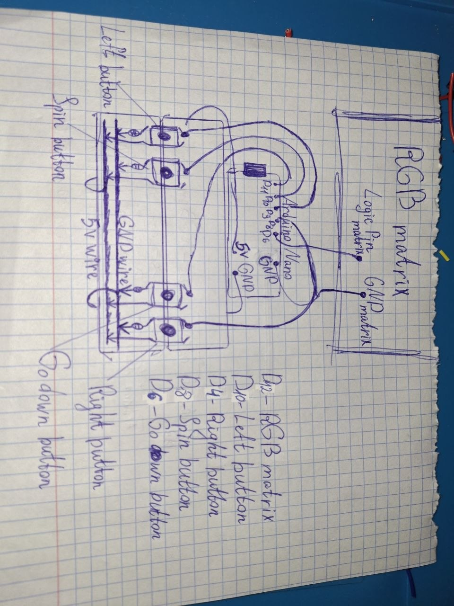
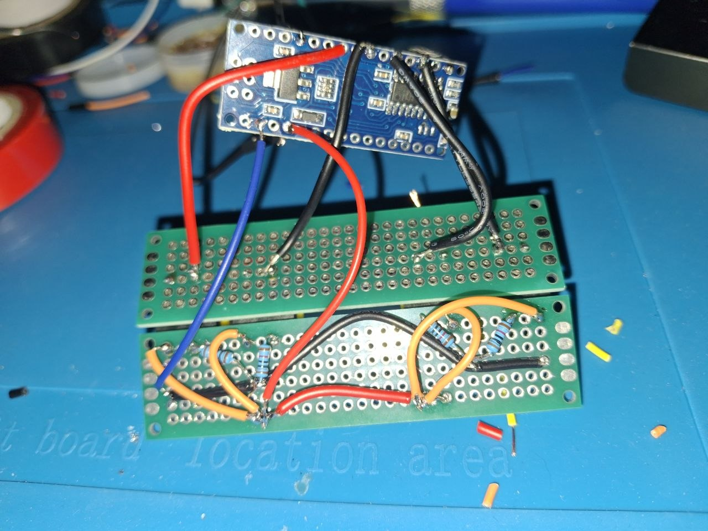

# Arduino Tetris

<p align="center">
  
</p>

<p align="center">
  <em>Final soldered Nano version.</em>
</p>

## Overview

This project started as a completely spontaneous challenge: I did not plan to make Tetris, but at some point I realized I would not respect myself if I did not build it.

`Arduino Tetris` is a fully self-written Tetris game for a 16x16 WS2812B RGB LED matrix, built around Arduino and later turned into a soldered physical device with four buttons. It began as a software challenge, unexpectedly became my first real soldering project, and ended as a playable handmade toy that I am genuinely proud of.

The code logic was written by me from scratch. I did not copy an existing Tetris implementation and adapt it. I built the game logic, fixed the bugs, and then pushed the project from a solder-free prototype to a soldered Nano version.

## What this project is

This is a mix of three things at once:

- an engineering project
- a personal build log
- a finished showcase of a playable handmade device

It was also a challenge to myself. After finishing my previous Arduino tic-tac-toe project, I suddenly felt that I needed to make Tetris too. Not because it was the most reasonable next step, but because it became one of those projects that simply had to exist.

## Main version

The main version of this repository is the **Soldered Nano version**.

The same core game logic works on both:

- **Solder-free Uno version**
- **Soldered Nano version**

I also kept the project adaptable to different boards and pin layouts. The game logic is not tied to one exact wiring layout, and the code contains commented pin options for different boards. Arduino Mega was considered only for memory-heavy visual extras, not because the gameplay itself required it.

## Features

This Tetris supports:

- move left
- move right
- rotate
- timed falling / one-step-down logic
- colored pieces
- visible border
- hidden rows above the visible field
- speed increase over time
- line clearing
- end game state
- start visual state
- end visual state
- next piece color preview

The game is simple on purpose. It is not overloaded with menus, score systems, or unnecessary extras. The point was to build a real playable physical Tetris device and make the logic work properly.

## Hardware used

### Main hardware

- **16x16 WS2812B RGB LED matrix**
- **Arduino Nano V3.0 clone**  
  ATmega328P, CH340
- **Arduino Uno R3 clone** for the earlier solder-free version
- **4 push buttons**
- **4 × 10kΩ resistors**
- **2 × 20x80 mm perfboards**
- jumper wires / connection wires
- soldered header contacts for matrix connection
- USB Type-C cable for Arduino Nano
- USB cable for Arduino Uno
- separate external **5V power supply** for the RGB matrix

### Important note

The matrix is powered separately. That matters. A 16x16 RGB matrix is not something I would politely ask a small Arduino board to power by itself without consequences.

## Software used

- **FastLED**
- Arduino IDE as the main development environment
- part of the logic was also written earlier in a phone IDE during the faster idea/build phase

## Code structure

The project logic is split into three classes:

- **`Game`**  
  handles the actual game logic: figure spawning, movement, collisions, hidden rows, line clearing, timing, and overall field state

- **`RGB_matrix`**  
  handles the visual side: reading the field state and displaying it on the LED matrix

- **`Buttons`**  
  reads user input from the physical controls

The idea is simple:

- the player interacts through buttons
- the `Game` class changes the state
- the `RGB_matrix` class only displays that state

That separation mattered a lot while writing the project. Without it, the whole thing would have turned into a glowing spaghetti tragedy much earlier.

## Why this project mattered to me

The value of this project was not only in the finished game.

It gave me:

- a more serious logic challenge than tic-tac-toe
- a full self-written game system instead of a simple toy mechanic
- my first real soldering practice
- a finished physical device that I can actually use

I originally thought this would just be another Arduino game idea. It turned out to be a much bigger milestone than expected.

## What was difficult

### 1. Coding difficulty

The hardest coding parts were not drawing pixels, but the actual game behavior:

- spawning figures correctly
- handling borders
- dealing with hidden rows
- making falling logic work cleanly
- checking collisions
- thinking through rotations
- combining everything into final `setup()` / `loop()` logic after a long pause

I wrote most of the core logic quickly, then stopped for about a month. After that pause, my own code felt almost alien for a while, which is both annoying and embarrassingly familiar.

### 2. Hardware difficulty

The project began as a solder-free Uno prototype, but the more I played it, the more obvious it became that I wanted a stable physical version. Breadboards are useful, but they are also very good at reminding you that "temporary" is not the same as "reliable".

### 3. Soldering difficulty

This project became my first real soldering experience.

At first, soldering did not go well at all:

- the cheap solder behaved badly
- the temperature settings were wrong
- tips oxidized and darkened
- the solder would not wet the tip properly

I managed to ruin **three tips** before switching to a better solder with flux. After that, everything became dramatically easier.

That part is important to me, because I did not originally start this project in order to learn soldering. It just happened naturally when I realized I wanted this Tetris to become a real device instead of a loose breadboard experiment.

### 4. A conscious hardware decision

I intentionally used **external 10kΩ resistors** for the buttons instead of relying on `INPUT_PULLUP`.

Yes, I could have simplified the button wiring in software.

I did not want to.

I wanted physical wiring practice, real connections, and real soldering experience. That decision made the build more complicated, but also much more useful as a hardware exercise.

## From Breadboard to Soldered Version

The project moved through two physical stages.

### Solder-free Uno version

A working prototype first existed on an Arduino Uno with a breadboard setup.

<p align="center">
  
</p>

That version was enough to prove the game logic and matrix behavior, but not enough for a stable long-term build.

### Hand-drawn connection scheme

At some point I drew the wiring scheme by hand, and unexpectedly really liked doing it.

<p align="center">
  
</p>

This drawing helped a lot when transferring the project from breadboard to perfboard. The final soldered wiring does not match the drawing perfectly, because during assembly I chose better practical connections where needed. But the scheme was still essential as a structure tool.

### Soldered Nano version

The final version was rebuilt around an Arduino Nano and two small perfboards.

<p align="center">
  
</p>

The point was not to make it pretty in a factory-perfect way. The point was to make it real, stable, and playable.

And it worked.

## Memory limitations and board flexibility

The project logic works on both Uno and Nano.

Arduino Mega was considered for one specific reason: **extra memory**.

The more beautiful animation version required more SRAM, so Mega was only relevant for that visual expansion. The actual gameplay logic does not need Mega. The project itself remains fully valid on Uno and Nano.

## Notes and media

This repository also includes additional material:

- **`notes.md`** — personal technical notes, development thoughts, and project log
- **`media_files/`** — images of the prototype, final build, soldered version, and a gameplay video

If you want the longer behind-the-scenes version of the project, the notes file is where a lot of the raw process lives.

The gameplay video is included in `media_files/video_game_process.mp4`.

## Minimal usage note

There is no dramatic setup ritual here.

Upload the code, connect the controls and matrix, power the matrix separately, and play.

## Repository structure

```structure
ARDUINO_Tetris/
├── main_code/
│   └── main_code.ino                # main Arduino source file
├── media_files/
│   ├── drawing_connection_scheme.jpg # hand-drawn wiring scheme
│   ├── solder_free_uno_version.jpg   # breadboard Uno prototype
│   ├── solder_nano_version.jpg       # final Nano build photo
│   ├── soldered_connections.jpg      # rear soldered wiring view
│   ├── soldered_front_side.jpg       # front-side view of the final button panel
│   └── video_game_process.mp4        # gameplay video
├── LICENCE                           # MIT license
├── notes.md                          # personal technical notes and dev log
└── README.md
```

## License

This project is released under the **MIT License**.

## Final words

This was a spontaneous project, but not a meaningless one.

I wrote the core logic in about a week, then paused, then finished the final integration over a few late nights. After that, over a few evenings of watching Formula 1, I learned how to solder and turned the project into a real playable physical build.

That matters to me.

I built a playable Tetris device with solder.  
I learned new hardware skills through it.  
And I am genuinely proud of it.


Finished. Time to build something new. 🙂